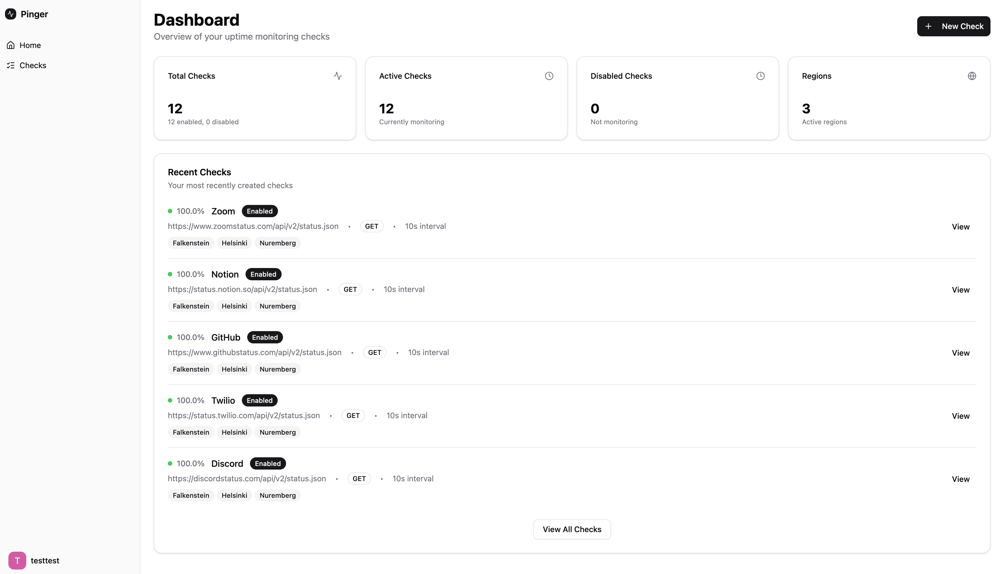
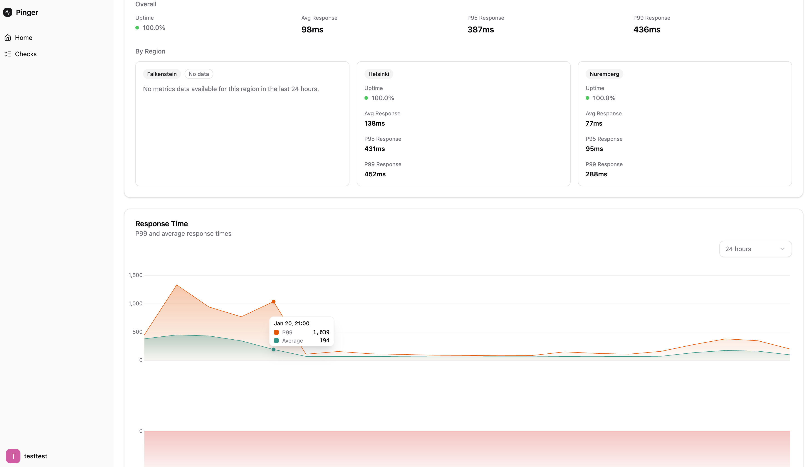
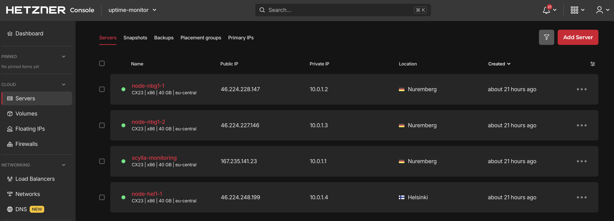
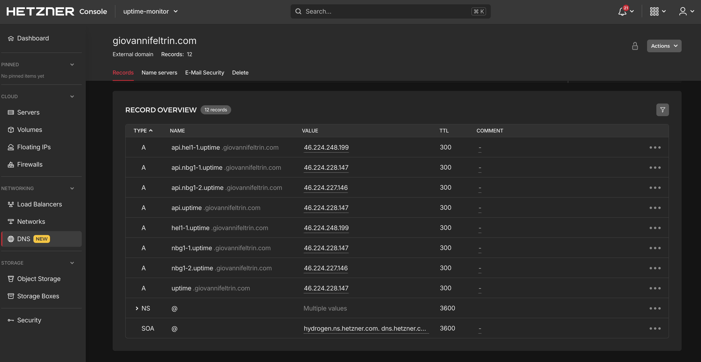

# Uptime Monitor

Distributed uptime monitoring with automatic load balancing via consistent hashing.

[Live website](https://uptime.giovannifeltrin.com/)
Credentials: `testtest`, `testtest`

**Stack**: Rust (Actix-web) · SvelteKit 5 · ScyllaDB · Terraform · Hetzner Cloud

## Architecture

```
┌──────────────────┐      ┌──────────────────┐      ┌──────────────────┐
│     Region A     │      │     Region B     │      │     Region C     │
│   (Falkenstein)  │      │    (Helsinki)    │      │   (Nuremberg)    │
├──────────────────┤      ├──────────────────┤      ├──────────────────┤
│  Caddy           │      │  Caddy           │      │  Caddy           │
│  Frontend        │      │  Frontend        │      │  Frontend        │
│  Backend API     │◄────►│  Backend API     │◄────►│  Backend API     │
│  ScyllaDB        │◄────►│  ScyllaDB        │◄────►│  ScyllaDB        │
│  Prometheus      │      │  Prometheus      │      │  Prometheus      │
└──────────────────┘      └──────────────────┘      └──────────────────┘
        gossip + replication via private network
```

Currently the DNS points to a single node. Adding a load balancer in front is trivial: all nodes are stateless and share ScyllaDB.

## Highlights

**100% type-safe API** - OpenAPI spec auto-generated from Rust types via utoipa. Frontend uses openapi-typescript for codegen. Zero hand-written API types. [Live docs](https://api.uptime.giovannifeltrin.com/swagger-ui/)

**Consistent hashing ring** - Workers own bucket ranges. Add/remove nodes without coordination. Position selection uses Beta distribution to minimize collisions. (`backend/src/collab/assignment.rs`)

**Drift-free scheduling** - Priority queue ordered by theoretical execution time, not wall clock. (`backend/src/worker/mod.rs`). Microsecond precision.

**SSRF protection** - DNS resolved before requests, private IPs blocked. (`backend/src/worker/check/execute.rs`, currently disabled due to bugs)

## Service-Oriented Architecture

```
┌─────────────────────────────────────────────────────────────────────────────┐
│                        PROCESS CENTRIC LAYER                                │
│  Orchestrates lower layers, handles user requests                           │
├─────────────────────────────────────────────────────────────────────────────┤
│  server/checks/       │  server/users/       │  server/auth.rs              │
│  - GET /checks        │  - POST /register    │  - POST /login               │
│  - POST /checks       │  - GET /me           │  - POST /logout              │
│  - GET /checks/{id}   │                      │  - Session management        │
│  - DELETE /checks     │                      │                              │
│  - GET /metrics       │                      │                              │
│  (orchestrates data   │                      │                              │
│   + business logic)   │                      │                              │
├─────────────────────────────────────────────────────────────────────────────┤
│                        BUSINESS LOGIC LAYER                                 │
│  Calculations, decisions, data manipulation                                 │
├─────────────────────────────────────────────────────────────────────────────┤
│  collab/assignment.rs      │  collab/heartbeat.rs   │  check_results/       │
│  - Consistent hashing      │  - Cluster membership  │    calculator.rs      │
│  - Bucket range calc       │  - Node liveness       │  - Uptime % calc      │
│  - Task distribution       │  - Failure detection   │  - P50/P95 latency    │
│                            │                        │  - Time-weighted avg  │
│  worker/mod.rs             │  collab/range_manager  │                       │
│  - Priority scheduling     │  - Range ownership     │                       │
│  - Drift prevention        │  - Dynamic rebalance   │                       │
├─────────────────────────────────────────────────────────────────────────────┤
│                          ADAPTER LAYER                                      │
│  External services, outside world                                           │
├─────────────────────────────────────────────────────────────────────────────┤
│  worker/check/execute.rs                                                    │
│  - HTTP client for monitored URLs                                           │
│  - DNS resolution                                                           │
│  - Response time measurement                                                │
│  - Status code capture                                                      │
├─────────────────────────────────────────────────────────────────────────────┤
│                           DATA LAYER                                        │
│  Persistence, retrieval, database access                                    │
├─────────────────────────────────────────────────────────────────────────────┤
│  queries/checks/      │  queries/users/      │  queries/sessions/           │
│  - CRUD operations    │  - User persistence  │  - Session storage           │
│  - Region filtering   │  - Password hashing  │  - Token validation          │
│                       │    (argon2)          │                              │
│  queries/check_results/                      │  database/                   │
│  - Time-bucketed storage                     │  - ScyllaDB connection       │
│  - Result persistence                        │  - Prepared statements       │
└─────────────────────────────────────────────────────────────────────────────┘
```

**Service count**: 12+ distinct services across 4 layers.

**Process orchestration example** - `GET /checks/{id}/metrics`:

1. Process layer receives request → validates session (calls auth service)
2. Calls data layer → fetches check ownership + raw results from ScyllaDB
3. Calls business logic → calculates uptime %, P50/P95 response times
4. Returns aggregated response to client

**External service**: HTTP health checker (adapter layer) makes outbound requests to user-defined URLs, measures response time, captures status codes.

**Internal database**: ScyllaDB (Cassandra-compatible), multi-region replication.

## Installation

> **Note**: Falkenstein region was unavailable during development. Checks there will not execute.

Create `terraform/prod.tfvars` with required variables (especially `hcloud_token` from Hetzner).

Initialize database:

```bash
# Take a random node's IP from Terraform output
IP=1.2.3.4

# The port might be different depending on your Terraform variables
# WARNING: this is NOT production ready
docker run --rm --entrypoint cqlsh scylladb/scylla $IP 8443 \
  -e "CREATE KEYSPACE IF NOT EXISTS default_keyspace \
      WITH replication = {'class': 'SimpleStrategy', 'replication_factor': 2};"
```

Run migrations:

```bash
# The port might be different depending on your Terraform variables
docker run --rm --entrypoint cqlsh \
  -v $(pwd)/backend/migrations:/migrations \
  scylladb/scylla $IP 8443 -k default_keyspace \
  -f /migrations/20251106152600_structure.cql
```

## Local Development

```bash
# Backend
# Populate .env file
cd backend && cargo run

# Frontend
# Populate .env file
cd frontend && npm install && npm run dev
```

## Notes

If on macOS, enable Rosetta in Docker to speed up `amd64` builds.

## Gallery








